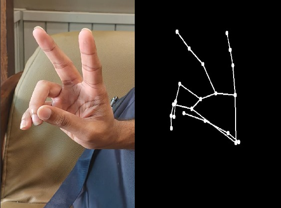

# Real-Time Gesture Controlled Robotic Hand

## 🛠️ Installation
### For **Windows**:
```bash
python -m venv Hand_sim
cd Hand_sim
.\Scripts\activate
cd src
pip install -r requirements.txt
```

### For **Mac/Linux**:
```bash 
python3 -m venv Hand_sim
cd Hand_sim
source bin/activate
cd src
pip install -r requirements.txt
```


## 1. Introduction
This project uses computer vision and serial communication to track human hand gestures via webcam and replicate them on a robotic hand in real time.

## 2. Project Overview
- Captures hand gestures using a webcam
- Tracks 21 landmarks (keypoints) on the hand using **Mediapipe**
- Draws a live skeletal representation of the hand
- Saves landmark positions to a text file
- Reads the positions and sends them to an Arduino
- The Arduino translates those coordinates into movements of a robotic hand. 


## :file_folder:File Structure
 ```bash .
 ├── hand_tracker.py          # Detects and tracks hand landmarks 
├── arduino_sender.py        # Sends landmark data to Arduino via serial 
├── main.py                  # Runs both scripts simultaneously
 ├── hand_data.txt            # Temporary file to store landmark coordinates 
├── README.md                # You're reading it! 
``` 

## :page_with_curl:Script Descriptions
### 1. hand_tracker.py
This script uses MediaPipe and OpenCV to detect a user's hand in real time and save 3D landmark coordinates(x,y,z) of its 21 keypoints in a text file 'hand_data.txt'.



### 2. arduino_sender.py
This script reads the hand coordinates from hand_data.txt and sends them over a serial port to the connected Arduino, which then moves the servo motors to replicate hand gestures.

### 3. main.py - Process Manager

- Starts hand tracking first
- Waits briefly to ensure data starts being written
- Starts Arduino communication


## :rocket:Applications
- Human computer Interaction
- Assistive robotics
- AR/VR gesture interfaces
